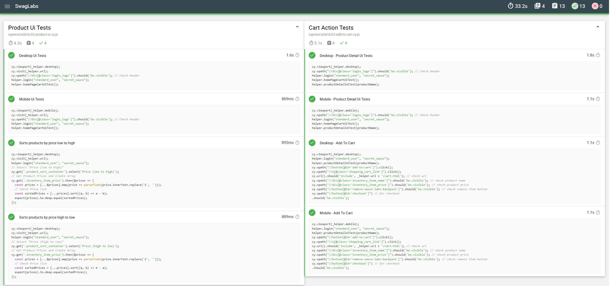
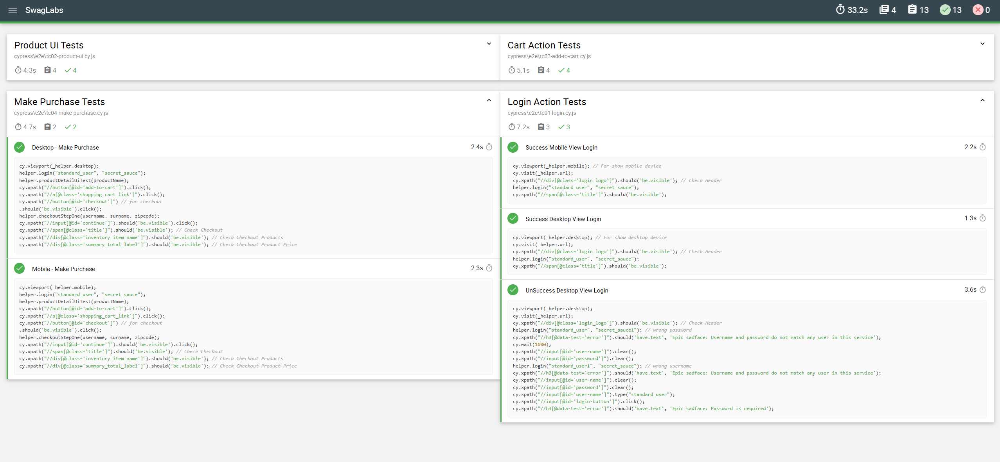
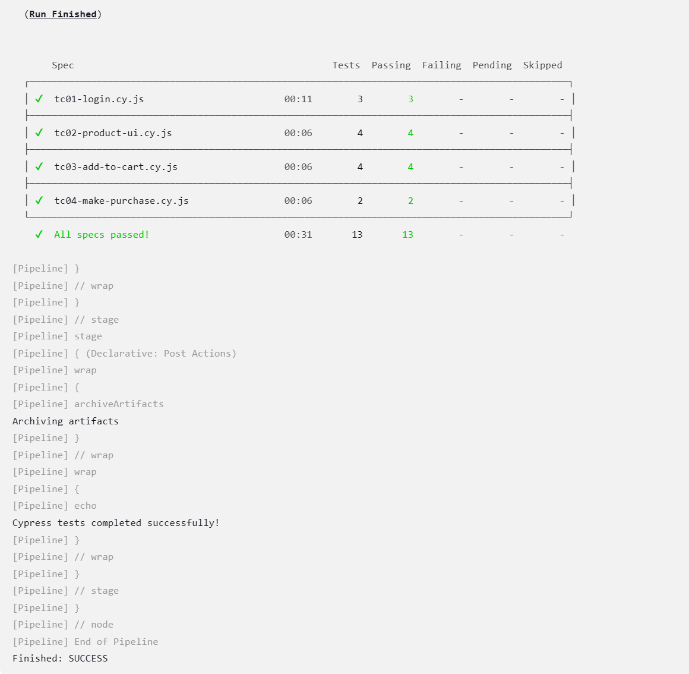

# Swag Labs Cypress Test Automation 

This project is an automated testing framework created using Cypress for e-commerce sites. It tests various functionalities and user interactions on both mobile and desktop browsers. The framework includes comprehensive test reporting using Mochawesome, providing detailed insights into test execution. Additionally, the project is integrated with Jenkins CI for continuous integration, enabling automated test runs and report generation in a CI/CD pipeline.

## Project Overview

This project includes four main testing categories:

- **Login Action Tests:**: Validates successful and unsuccessful login attempts on both mobile and desktop views.
- **Product UI Tests:**: Checks the product listing UI, sorting functionality, and product details.
- **Cart Action Tests:**: Verifies adding products to the cart, viewing cart details, and checking product information in the cart on both mobile and desktop views.
- **Purchase Tests:**: Tests the complete purchase process, including checkout and verification of the order details.

### Helper Functions

`helper.js` provides reusable functions:
- `login(username, password)`: Logs in with provided credentials.
- `homePageCartUiTest()`: Checks UI elements on the homepage.
- `productDetailUiTest(productName)`: Checks product details on the product page.
- `checkoutStepOne(username, surname, zipcode)`: Fills out the first step of the checkout process.

### Configuration

- **Service Workers:** Service workers are unregistered before each test to ensure a clean test environment.
- URL: `https://www.saucedemo.com`
For browser testing, this project utilizes:

- Mobile Viewport: `cy.viewport('iphone-x')`
- Desktop Viewport: `cy.viewport('macbook-15')`


## Test Case Examples

Each test file includes a variety of test cases:
- **`tc-01-login.cy.js`**:
  - Success and failure login scenarios for both mobile and desktop views.
- **`tc-02-product-ui.cy.js`**:
  - Product UI checks, including sorting by price (low to high and high to low).
- **`tc-03-add-to-cart.cy.js`**:
  - Adding products to the cart and verifying cart details on both mobile and desktop views.
- **`tc-04-make-purchase.cy.js`**:
  - Completing a purchase process and verifying order details.

## Getting Started

### Requirements
- Node.js
- Cypress
- Cypress XPath Plugin

### Installation
1. Clone the repository:
    ```bash
    git clone https://github.com/batuhanngulec/SwagLabsTestAutomation.git
    ```
2. Navigate to the project directory:
    ```bash
    cd SwagLabsTest
    ```
3. Install the project dependencies:
    ```bash
    npm install
    ```

    If Cypress is not already listed in your `package.json`, add it by running:
    ```bash
    npm install cypress --save-dev
    ```
4. **Install Cypress XPath Plugin**:
    To use XPath selectors, you need to install the Cypress XPath plugin:
    ```bash
    npm install cypress-xpath --save-dev
    ```

5. **Add XPath Support**:
    To enable XPath support, add the following line to your Cypress `support/index.js` file:
    ```javascript
    require('cypress-xpath');
    ```

6. **Install Mochawesome Reporter**:
    For generating detailed test reports, install the Mochawesome reporter:
    ```bash
    npm install mochawesome mochawesome-merge mochawesome-report-generator --save-dev
    ```

7. **Configure Mochawesome Reporter**:
    Update your Cypress configuration (`cypress.json`) to use Mochawesome reporter:
    ```json
    {
      "reporter": "mochawesome",
      "reporterOptions": {
        "reportDir": "cypress/reports",
        "reportFilename": "report",
        "quiet": true,
        "overwrite": false,
        "html": true,
        "json": true
      }
    }
    ```

### Running the Tests
To run the Cypress tests, use the following command:
```bash
npx cypress open
 ```

## Test Results

### 1- Mochawesome Test Report

You can view the latest test report generated by Mochawesome in the [test results report](./cypress/reports/html/index.html).

#### Test Reports

Here are some screenshots of the test reports:




### 2- Jenkins CI Report

This project is integrated with Jenkins for continuous integration. Below is a brief overview of how Jenkins is used to run Cypress tests and generate reports.

The Jenkins pipeline is configured to automatically run the Cypress tests and generate test reports using Mochawesome. Here's a summary of the stages in the Jenkins pipeline:

1. **Checkout:** The project repository is cloned from GitHub.
2. **Install Dependencies:** The necessary Node.js dependencies, including Cypress, are installed.
3. **Run Cypress Tests:** Cypress tests are executed with the Mochawesome reporter to generate test reports.

#### Jenkins Pipeline Execution

Once the pipeline runs successfully, the test results are archived and can be viewed in the Jenkins interface. Below are screenshots of the Jenkins pipeline execution and test results:

```groovy
pipeline {
    agent any

    stages {
        stage('Checkout') {
            steps {
                wrap([$class: 'AnsiColorBuildWrapper', colorMapName: 'xterm']) {
                    // Clone Git
                    git branch: 'main', url: 'https://github.com/batuhanngulec/SwagLabsTestAutomation'
                }
            }
        }

        stage('Install Dependencies') {
            steps {
                wrap([$class: 'AnsiColorBuildWrapper', colorMapName: 'xterm']) {
                    bat 'npm install'
                }
            }
        }

        stage('Run Cypress Tests') {
            steps {
                wrap([$class: 'AnsiColorBuildWrapper', colorMapName: 'xterm']) {
                    // Cypress Run
                    bat 'npx cypress run'
                }
            }
        }
    }

    post {
        always {
            wrap([$class: 'AnsiColorBuildWrapper', colorMapName: 'xterm']) {
                archiveArtifacts artifacts: 'cypress/screenshots/**/*, cypress/videos/**/*, cypress/reports/**/*', allowEmptyArchive: true
            }
        }
        failure {
            wrap([$class: 'AnsiColorBuildWrapper', colorMapName: 'xterm']) {
                echo 'Cypress tests failed!'
            }
        }
        success {
            wrap([$class: 'AnsiColorBuildWrapper', colorMapName: 'xterm']) {
                echo 'Cypress tests completed successfully!'
            }
        }
    }
}
```



## References

Here are some resources that were instrumental in building and maintaining this project:

- [Cypress](https://www.cypress.io) - End-to-end testing framework used for automating the tests.
- [Jenkins](https://www.jenkins.io) - Continuous integration server used to automate the running of tests.
- [Cypress Mochawesome Reporter](https://www.npmjs.com/package/cypress-mochawesome-reporter) - Reporter plugin used for generating detailed test reports.
- [Cypress XPath](https://www.npmjs.com/package/cypress-xpath) - Plugin for using XPath selectors in Cypress tests.
- [Git Action](https://github.com/cypress-io/github-action) - For continuous integration and continuous delivery (CI/CD) platform that automates build, test, and deployment pipelines.